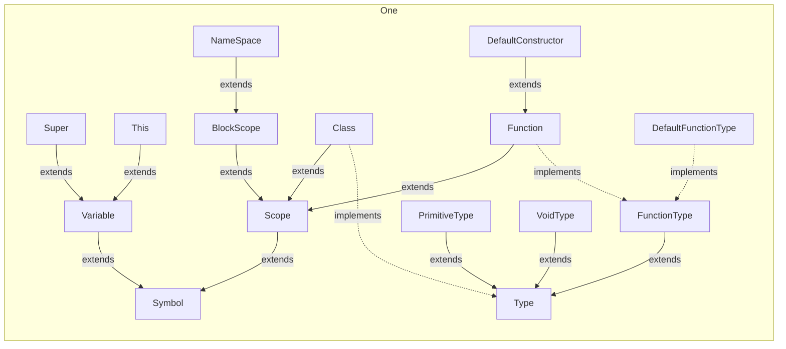
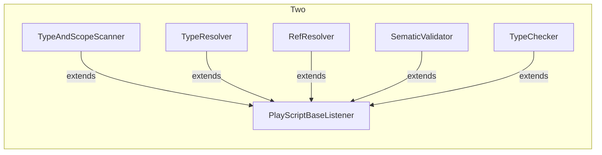
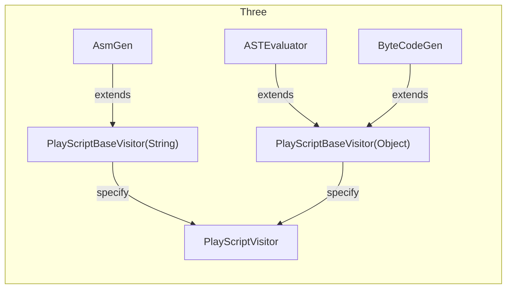
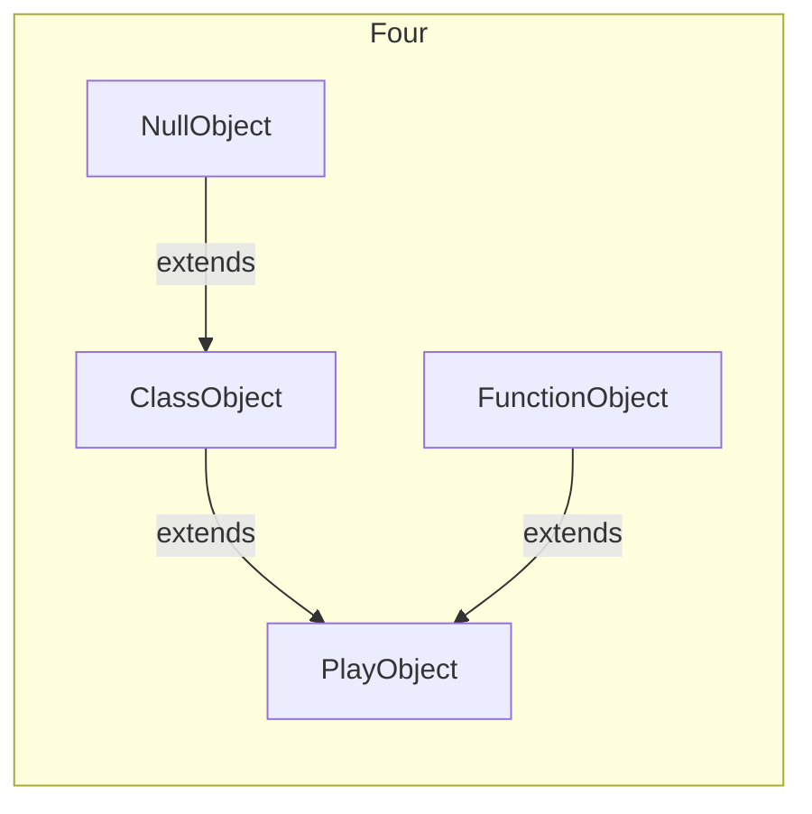

## The Chrome extension [GitHub + Mermaid](https://chrome.google.com/webstore/detail/github-%2B-mermaid/goiiopgdnkogdbjmncgedmgpoajilohe?hl=en) will help if you are seeing texts instead of graphs.

