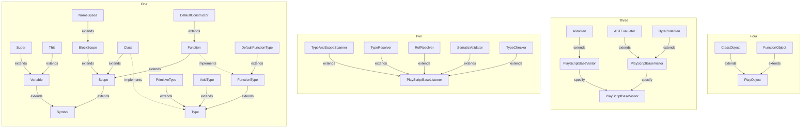

```mermaid
graph BT

  subgraph Four
  ClassObject -- extends --> PlayObject
  FunctionObject -- extends --> PlayObject
  end

  subgraph Three
  PlayScriptBaseVisitor_string(PlayScriptBaseVisitor<string>) -- specify --> PlayScriptBaseVisitor
  PlayScriptBaseVisitor_object(PlayScriptBaseVisitor<Object>) -- specify --> PlayScriptBaseVisitor
  AsmGen -- extends --> PlayScriptBaseVisitor_string
  ASTEvaluator -- extends --> PlayScriptBaseVisitor_object
  ByteCodeGen -- extends --> PlayScriptBaseVisitor_object
  end

  subgraph Two
  TypeAndScopeScanner -- extends --> PlayScriptBaseListener
  TypeResolver -- extends --> PlayScriptBaseListener
  RefResolver -- extends --> PlayScriptBaseListener
  SematicValidator -- extends --> PlayScriptBaseListener
  TypeChecker -- extends --> PlayScriptBaseListener
  end

  subgraph One
  Scope -- extends --> Symbol
  Variable -- extends --> Symbol
  Super -- extends --> Variable
  This -- extends --> Variable
  BlockScope -- extends --> Scope
  NameSpace -- extends --> BlockScope
  Class -- extends --> Scope
  Class -.-> |implements| Type
  FunctionType -- extends --> Type
  Function -- extends --> Scope
  Function -.-> |implements| FunctionType
  PrimitiveType -- extends --> Type
  VoidType -- extends --> Type
  DefaultConstructor -- extends --> Function
  DefaultFunctionType -- extends --> FunctionType
  end
```
